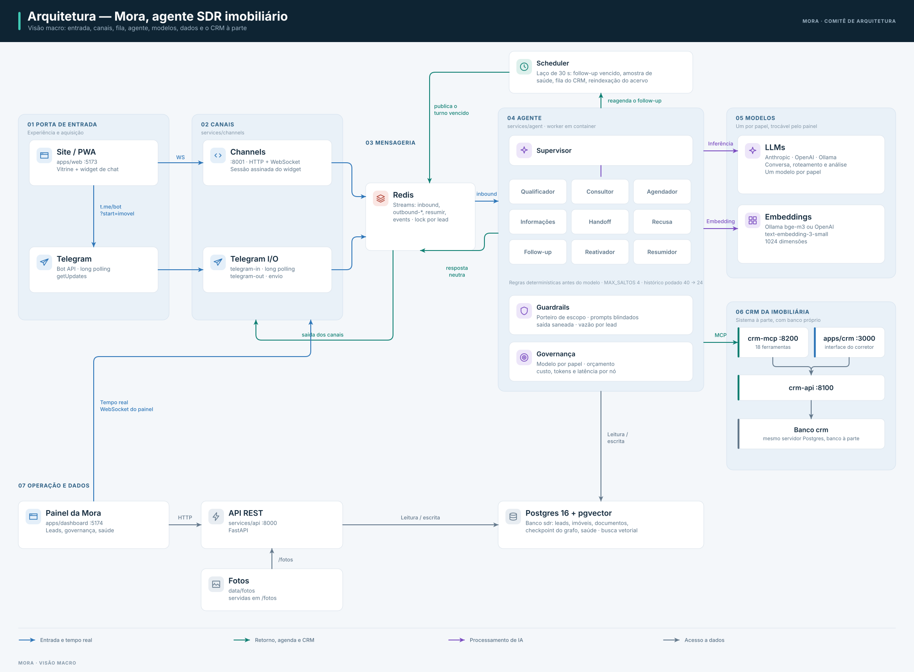

# Mora — Agente SDR Imobiliário da Vértice Imóveis

[](https://github.com/marcosvrc/agent-sdr-imoveis-mora/actions/workflows/ci.yml)
[](https://marcosvrc.github.io/agent-sdr-imoveis-mora/)
[](LICENSE)


Prova de conceito (POC) de um **SDR (Sales Development Representative) imobiliário com IA
generativa**. A agente virtual **Mora** atende o cliente pelo site e pelo Telegram, entende o que ele
procura, recomenda imóveis do catálogo, agenda visitas e entrega o lead qualificado — com briefing —
a um corretor humano. Um **CRM** à parte, com banco e login próprios, é onde a equipe opera; a Mora
escreve nele por **MCP**, com credencial de serviço e limites explícitos.

**Status:** POC. A entrega inteira roda na máquina de quem avalia, por `docker compose`; nada está
implantado, e isso é escolha (ver [Roadmap](docs/project/roadmap.md)).

> **Este README é o guia de entrada.** Cada seção resume o assunto e aponta para a página
> detalhada em [`docs/`](docs), publicada como portal em
> **https://marcosvrc.github.io/agent-sdr-imoveis-mora/** (MkDocs Material, workflow
> [`docs.yml`](.github/workflows/docs.yml)). Os documentos longos foram separados de propósito: o
> manual do CRM sozinho tem mais de 600 linhas.

## Sumário

1. [Contexto do projeto](#1-contexto-do-projeto)
2. [Tecnologias utilizadas](#2-tecnologias-utilizadas)
3. [Pré-requisitos](#3-pré-requisitos)
4. [Como executar](#4-como-executar)
5. [Arquitetura](#5-arquitetura) · [5.1 Componentes](#51-componentes-da-arquitetura)
6. [Funcionalidades do agente](#6-funcionalidades-implementadas-no-agente)
7. [Modelos utilizados](#7-modelos-utilizados-decisões-e-comparativos)
8. [Agente e subagentes por dentro](#8-detalhes-do-agente-e-subagentes)
9. [Manual de uso](#9-manual-de-uso)
10. [Regras de negócio](#10-regras-de-negócio)
11. [Atividades futuras](#11-atividades-futuras)
12. [Qualidade: testes, CI, segurança](#12-qualidade-testes-ci-e-segurança)
13. [Estrutura do repositório](#13-estrutura-do-repositório)
14. [Licença e autoria](#14-licença-e-autoria)

---

## 1. Contexto do projeto

Imobiliárias perdem lead no intervalo entre o primeiro contato e a primeira resposta humana: o
cliente escreve à noite, pelo celular, e quer saber na hora se o imóvel serve, quanto custa e quando
pode visitar. O desafio (briefing em [`docs/agente-sdr-imobiliario.md`](docs/agente-sdr-imobiliario.md))
pede um agente que faça esse primeiro atendimento com IA generativa, para a **Vértice Imóveis**, uma
imobiliária fictícia de São Paulo, em três cenários: **compra**, **investimento** e **follow-up** de
quem parou de responder.

O que a Mora faz, em uma frase por etapa:

| Etapa | O que acontece | Quem decide |
|---|---|---|
| Atendimento | Conversa em português pelo widget do site ou pelo Telegram (texto, botões e áudio) | Mora |
| Qualificação | Preenche um **cartão** (intenção, região/bairros, orçamento, quartos, urgência; ou perfil, ticket e retorno esperado para investidor) sem interrogatório | Mora |
| Recomendação | Busca híbrida (filtros + semântica) no catálogo, descendo de bairro para vizinhos, região e cidade, e **diz até onde precisou ir** | Mora |
| Visita | Oferece horários reais (do CRM ou da agenda interna), reserva e **pede** a visita | Mora reserva; **pessoa confirma** |
| Passagem | Encaminha ao corretor certo (região + carga), com briefing e análise da conversa | Mora encaminha; corretor assume |
| Follow-up | Volta a falar com quem sumiu, na cadência da temperatura do lead, dentro do horário civilizado; reativa lead adormecido quando entra imóvel que combina | Mora, com opt-out do cliente |
| Registro | Espelha lead, oportunidade, preferências, interações e interesses no CRM — até o estágio `qualified`, nunca além | Mora, com limites do CRM |

Limites deliberados: a Mora **não cadastra imóvel, não confirma visita, não muda o estágio além de
qualificado e não inventa disponibilidade** — cada um desses é uma trava no código, não uma
instrução no prompt. Mais em [Contexto](docs/overview/contexto.md) e
[Decisões](docs/decisions.md).

## 2. Tecnologias utilizadas

| Camada | Tecnologia | Para quê |
|---|---|---|
| Linguagens | Python 3.12 · TypeScript 5.5 | Serviços e front-ends |
| Agente | LangGraph ≥0.2, LangChain Core ≥0.3, Pydantic v2 | Grafo supervisor + especialistas, saída estruturada, contratos |
| LLM | Anthropic (Claude Sonnet/Haiku, padrão) · OpenAI (reserva) · Ollama (local, sem chave) | Conversa, roteamento/extração e análise, um modelo por papel |
| Embeddings | `bge-m3` via Ollama ou `text-embedding-3-small` (OpenAI), 1024 dimensões | RAG de imóveis e da base institucional |
| Voz | faster-whisper (CPU, `int8`) | Transcrição de áudio do Telegram |
| Backend | FastAPI ≥0.115, Uvicorn, psycopg 3 (pool), redis-py, `mcp` SDK, argon2, cryptography | APIs, canais, workers, servidor MCP, senha e cifra |
| Dados | PostgreSQL 16 + pgvector (HNSW, cosseno) — dois bancos: `sdr` (Mora) e `crm` | Relacional, vetores, checkpoint do grafo, observabilidade |
| Fila | Redis 7 Streams (consumer groups, locks) | Canais → agente → canais; retomada de pendentes |
| Front-ends | React 18, Vite 7, Tailwind 3.4, TanStack Query 5, React Router 6, Recharts, Zustand (site), vite-plugin-pwa | Site vitrine (PWA), painel da Mora, CRM |
| Canais | Telegram Bot API (long polling) · WebSocket próprio (site) | Sem URL pública, sem túnel |
| Execução | Docker Compose (uma imagem Python, um comando por container) | A entrega inteira |
| Qualidade | pytest (650 testes, Postgres real), ruff, pyright básico, eslint, coverage com piso, harness de avaliação | CI no GitHub Actions |
| Docs | MkDocs Material, ADRs, OpenAPI versionado | Portal no GitHub Pages |

Versões e finalidade de cada pacote: [Tecnologias](docs/technical-reference/tecnologias.md).

## 3. Pré-requisitos

**Para rodar (recomendado):**

- Git, Docker e Docker Compose.
- Uma chave de LLM — `ANTHROPIC_API_KEY` (padrão) ou `OPENAI_API_KEY` — **ou** nenhuma, usando o
  perfil `ollama` do compose (modelo local, sem custo; mais lento e menos preciso).
- Opcional: token de bot do Telegram (`@BotFather`) para o canal externo; sem ele sobra o chat do site.
- Opcional: `CRM_MCP_TOKEN` para ligar a ponte com o CRM; sem ele a Mora roda sozinha.

**Para desenvolver ou rodar os testes no host:** Python 3.12, `pip` ou `uv` (o `Makefile` usa `uv`),
Node.js **20.19+** (exigência do Vite 7; a imagem `node:20-alpine` do compose atende).

**Hardware:** não há medição versionada. Com Ollama local (bge-m3 + um modelo de chat) conte com
vários GB de RAM a mais; com provedor hospedado, o compose roda confortavelmente em um notebook.
Detalhes: [Pré-requisitos](docs/getting-started/pre-requisitos.md).

## 4. Como executar

```bash
git clone https://github.com/marcosvrc/agent-sdr-imoveis-mora.git
cd agent-sdr-imoveis-mora

cp -n local/.env.example local/.env      # edite ANTHROPIC_API_KEY (e CRM_MCP_TOKEN, se for usar o CRM)
make check-env                           # confere o local/.env antes de subir nada
make local-ollama                        # sobe tudo (ou `make local`, sem o serviço do Ollama)

# em OUTRO terminal, com o compose no ar:
make preparar                            # bancos, schemas e massa, na ordem certa (idempotente)
make crm-token                           # credencial da Mora no CRM — aparece UMA vez; cole em CRM_API_TOKEN
cd local && docker compose up -d crm-mcp agent && cd ..
make ollama-pull && make seed && make docs-kb   # embeddings, acervo e base institucional
```

`make` sozinho imprime essa ordem — é o alvo padrão e a fonte que se mantém em dia com o
`Makefile`. Depois de mudar schema ou dependência Python: `cd local && docker compose up -d --build`
(**não** `restart`, que não roda o `db-init`).

| Serviço | URL | Saúde |
|---|---|---|
| Site (PWA + chat) | http://localhost:5173 | — |
| Painel da Mora | http://localhost:5174 | — |
| API da Mora (Swagger em `/docs`) | http://localhost:8000 | `GET /health` |
| Canais (WebSocket do chat) | ws://localhost:8001/ws | `GET /health` |
| CRM — interface | http://localhost:3000 | — |
| CRM — API | http://localhost:8100 | `GET /health/ready` (confere o schema inteiro) |
| CRM — servidor MCP | http://localhost:8200/mcp | `GET /saude` |
| Postgres · Redis · Ollama | `127.0.0.1:5433` · `:6380` · `:11435` | só loopback |

Variáveis de ambiente, uma a uma: [Configuração](docs/getting-started/configuracao.md). Execução
fora do compose, validação e problemas comuns: [Primeiros passos](docs/getting-started/docker.md),
[Validação](docs/getting-started/validacao.md), [Troubleshooting](docs/quality/troubleshooting.md).

## 5. Arquitetura

O sistema separa o **cérebro** (o agente) dos **canais** (site, Telegram) e do **sistema comercial**
(o CRM). O agente não sabe por qual canal a mensagem chegou: cada canal traduz o evento do provedor
para uma `MensagemNormalizada` e a `RespostaAgente` de volta para o formato do canal. O CRM é um
sistema à parte — banco, API, login e interface próprios — e a Mora entra nele por uma única porta,
o servidor MCP, com credencial de serviço. A única dependência cruzada permitida entre serviços é o
pacote `shared/`.

<p align="center">
  <picture>
    <source media="(prefers-color-scheme: dark)" srcset="docs/assets/diagramas/macro-escuro.svg">
    
  </picture>
</p>

**Fluxo de um turno.** O canal publica em `sdr:inbound`; o worker do agente toma o lock do lead,
roda o grafo (supervisor decide por regras determinísticas antes de gastar modelo; especialistas
respondem), grava lead e histórico, publica a resposta em `outbound-<canal>`, espelha o turno no
CRM e reagenda o follow-up. Se o CRM está fora do ar, o turno vai para `crm_pendencias` e o
scheduler o republica depois. Sequência completa em
[Fluxo do agente](docs/architecture/fluxo-agente.md); diagramas C4 em
[Diagramas](docs/architecture/diagramas.md) e [`docs/ARCHITECTURE.md`](docs/ARCHITECTURE.md).

### 5.1 Componentes da arquitetura

Resumo — a página [Componentes](docs/architecture/componentes.md) detalha cada um (tabelas,
tópicos, ferramentas, limites, o que acontece em falha):

| Componente | O que é | Pontos que importam |
|---|---|---|
| **Banco** — Postgres 16 + pgvector | Dois bancos no mesmo servidor: `sdr` (Mora) e `crm` (CRM), schemas em `shared/sdr_shared/db/schema.sql` e `services/crm/sdr_crm/db/schema.sql` | Leads, mensagens, cartão, `imoveis` (réplica sincronizada do catálogo do CRM, com vetor na mesma linha), `documentos` (RAG institucional), visitas, corretores, `crm_vinculo`/`crm_pendencias`, observabilidade (`turnos`, `saude`, `uso_llm`, `batimentos`), checkpoint do LangGraph. Schema reaplicado pelo `db-init` a cada `up`; pool por processo (`SDR_DB_POOL_MAX`) |
| **Fila** — Redis 7 Streams | Mensageria entre canais e agente; **não** é cache de dados de negócio | Tópicos `sdr:inbound`, `outbound-web`, `outbound-telegram`, `resumir`, `events`; consumer group por tópico; lock por lead com validade derivada do orçamento do turno; retomada de pendentes no boot (PEL + `XAUTOCLAIM`); `profundidade()` alimenta a tela Saúde |
| **RAG** — pgvector + embeddings | Busca de imóveis e de trechos institucionais | Filtros SQL + cosseno na mesma consulta; cascata bairro → vizinhos → região → cidade com o nível informado ao modelo; um embedding por busca; sem embedder cai para filtros; texto externo neutralizado antes do prompt; fotos painel > CRM > arquivo (ADR-0015) |
| **MCP** — ponte Mora ↔ CRM | Servidor MCP do CRM (`crm-mcp`, 18 ferramentas) + porta `ports/crm.py` + adaptador `via_mcp.py` | A decisão fica no código, o MCP é transporte; sessão por turno; sessão inerte quando o CRM cai; idempotência por `operation_id`/`external_event_id`; fila de pendências com backoff; `exigir_humano` — credencial de serviço nunca escreve o acervo |
| **Agentes** — LangGraph | Supervisor + 9 especialistas sobre um estado único, checkpoint em Postgres | Regras antes do LLM; `MAX_SALTOS=4` e guarda de repetição; poda do histórico 40 → 24; prompts blindados com sentinela; modelo por papel com fallback de provedor; governança de custo por nó e lead |
| **Canais** | WebSocket do site (`services/channels/local`) e Telegram (`services/channels/telegram`) | Sessão do widget assinada pelo servidor; credencial do painel no primeiro quadro, nunca na URL; entrega de respostas pendentes na reconexão; transcrição de áudio |
| **APIs e front-ends** | API da Mora + painel; API do CRM + interface do CRM | Painel: token da equipe, tempo real, auditoria; CRM: login por usuário (argon2, sessão 12 h, teto de tentativas), credenciais de serviço com scopes, rate limit, teto de corpo, idempotência |
| **Scheduler** | Laço de 30 s | Follow-ups vencidos, amostra de saúde, drenagem de `crm_pendencias`, reindexação incremental do acervo (15 min) |
| **Observabilidade leve** | Tabelas no Postgres (ADR-0011) | Sem stack externa: `turnos` com caminho e duração, `saude` com filas e latência, `uso_llm` com custo; a tela Saúde dá o veredito e o porquê |

Decisões e alternativas descartadas: [ADRs](docs/architecture/decisoes.md) (15) e
[Registro de decisões](docs/decisions.md) (D-01 … D-19).

## 6. Funcionalidades implementadas no agente

A lista completa, com "como funciona por baixo", limites numéricos e comportamento em falha para
cada item, está em **[Funcionalidades](docs/overview/funcionalidades.md)** (≈440 linhas). O que a
Mora faz:

- **Roteamento** — uma dúzia de regras determinísticas em ordem fixa (pedido de humano, opt-out, escopo,
  visita, escolha de horário, pedir opções, pergunta institucional…) antes de qualquer chamada de
  modelo; o LLM de roteamento só decide o resto, entre 5 destinos.
- **Qualificação** — extração estruturada do cartão a cada mensagem (modelo barato, saída tipada),
  merge que nunca apaga o que já sabia, campos obrigatórios por intenção, normalização de local
  (bairro, região, ponto de referência, fora de cobertura), absorção de nome/telefone/e-mail, nova
  oportunidade quando a intenção muda em lead encerrado, apresentação só na primeira mensagem.
- **Recomendação** — até 3 imóveis por turno com motivo, sem repetir o que o cliente já viu ou
  descartou (`interesses`), alternativa no bairro pedido quando o perfil exato não existe, e um
  contexto de busca que proíbe o modelo de afirmar disponibilidade que não veio da lista.
- **Agendamento** — horários do CRM (até 8) ou da grade interna, como botões; reserva em um turno,
  pedido de contato antes de reservar; a confirmação é humana, no CRM; remarcação e cancelamento são
  operações do CRM, refletidas no índice.
- **Handoff** — corretor escolhido por região e carga; briefing e análise (sentimento,
  engajamento, perfil de decisão, como abordar) gerados fora do turno do cliente; enquanto o humano
  está no controle, a Mora cala e só notifica.
- **Follow-up e reativação** — cadência `[120, 1440, 4320]` min × ritmo por temperatura
  (quente 0,25 · morno 1 · frio 2), janela 08:00–20:00 em São Paulo, desligável no painel;
  reativação de lead adormecido quando entra imóvel compatível (ADR-0013), com opt-out em uma frase.
- **Perguntas institucionais** — RAG sobre a base de conhecimento (fiador, IPTU, documentação,
  pets…), com citação da fonte e resposta honesta quando não há base.
- **Segurança da conversa** — porteiro de escopo (com contagem de recusas e homóglifos), prompts
  blindados por sentinela aleatória, nome e cartão em marcador próprio, saída saneada contra
  vazamento de instrução e dados sensíveis, vazão de 5 msg/10 s e 60 msg/h por lead.
- **Canais** — texto, botões e áudio (Telegram: `voice`, `audio`, `video_note`) com recibo
  imediato; widget web com reconexão e entrega de pendentes.
- **Memória** — histórico por lead em checkpoint Postgres com poda, cartão persistido,
  reconhecimento de cliente que o CRM já conhece.
- **Governança** — modelo por papel trocável pelo painel sem reiniciar, orçamento mensal/diário
  com alerta, degradação e bloqueio, registro de tokens/custo/latência por nó e lead, fallback de
  provedor.
- **Resiliência** — turno falhou → resposta de fallback e handoff; sem Redis → recusa antes de
  gastar modelo; sem embedder → busca por filtros; sem CRM → conversa segue e o turno entra na fila.

## 7. Modelos utilizados (decisões e comparativos)

Página completa: **[Modelos de linguagem](docs/architecture/modelos.md)**.

- **Um modelo por papel** (ADR-0010): `conversa` (temperatura 0,6), `roteamento`/extração
  (temperatura 0, saída estruturada) e `analise` (herda o de conversa se não configurado). Padrões
  do `.env`: `claude-sonnet-4-5` para conversa e `claude-haiku-4-5` para roteamento; tudo trocável
  pelo painel, que só aceita modelo com preço cadastrado (Ollama dispensa).
- **Provedores**: Anthropic (padrão), OpenAI (reserva — é o próprio fornecedor, sem intermediário
  no dado do cliente), Ollama (100 % local, sem chave), OpenRouter só para bancada (ADR-0009). O id
  do modelo é traduzido entre famílias na troca de provedor.
- **Comparativo**: o painel compara os modelos de um provedor pelo **custo do seu uso real** (mix
  de tokens por papel dos últimos dias), pela **latência medida** e por um **contrafactual**
  ("quanto custaria o mês com o modelo X"), com recomendações de uso. Com a tabela de preços atual, a
  ordem por custo é a mesma em todos os papéis (há teste prendendo isso):
  `gpt-5-nano` < `gpt-5.6-luna` < `gpt-5-mini` < `claude-haiku-3-5` < `claude-haiku-4-5` <
  `claude-sonnet-5` < `gpt-5.6-terra` < `claude-sonnet-4/4-5/4-6` < `gpt-5.6-sol` < `claude-opus-5`
  < `gpt-6-astra` < `claude-opus-4/4-1`.
- **Timeout e retries**: 45 s por chamada (5–180 pelo painel), uma tentativa extra por provedor,
  pior caso do turno derivado disso e usado como validade do lock por lead.
- **Embeddings** `bge-m3` (Ollama) ou `text-embedding-3-small` a 1024 dimensões — a dimensão é
  fixa no schema. **Transcrição** faster-whisper `small`, CPU, `int8`, português.
- **Qualidade**: o harness de avaliação (`make eval`, `make eval-rag`) existe e é testado no CI com
  dublês; **não há resultado com modelo real versionado** — a página diz isso em vez de inventar
  benchmark.

## 8. Detalhes do agente e subagentes

Página completa: **[Fluxo do agente](docs/architecture/fluxo-agente.md)** (≈890 linhas: sequência
do turno, `handler.processar` passo a passo na ordem do código, estado do grafo, supervisor com as
regexes, cada especialista, cartão, contexto dos prompts, guardrails, estágios, follow-up, CRM,
governança e uma tabela "mensagem → caminho esperado" tirada dos testes).

Em resumo, um turno é:

1. **Antes do grafo** (`handler.py`): transcrição se áudio → PING no barramento (sem Redis, o turno
   é recusado antes de gastar modelo) → vazão → carrega/cria o lead → registra a mensagem → se o
   corretor está no controle, cala e notifica → bloqueio por orçamento → reconhecimento no CRM.
2. **Supervisor**: aplica as regras na ordem (opt-out → escopo → humano → visita/horário → opções
   → institucional → …); só na ambiguidade chama o modelo de roteamento. Cada turno reseta
   `saltos`, `resposta`, `cartao_extraido_de` e `ultimo_no`; o grafo encerra ao ver `resposta`, ao
   bater `MAX_SALTOS=4` ou quando um nó devolve sem mudar a decisão.
3. **Especialistas**: `qualificador` (extrai e pergunta o que falta; passa ao consultor quando o
   cartão fecha, sem extrair a mesma frase duas vezes), `consultor` (busca e apresenta),
   `agendador` (dois turnos: oferecer e reservar), `informacoes` (RAG institucional), `handoff`,
   `recusa` (texto fixo, sem LLM), `followup`, `reativador`, `resumidor` (fora do turno do cliente).
4. **Contexto**: persona + bloco de regras de segurança + prompt do nó; a mensagem do cliente entra
   em bloco delimitado por sentinela aleatória, nome e cartão em marcador em linha; chave faltante
   no template **estoura** em vez de virar instrução ilegível; histórico podado a 24 mensagens.
5. **Depois do grafo**: score e temperatura → persistência → despacho ao canal → eventos →
   espelho no CRM (ou fila) → follow-up reagendado → linha em `turnos` com caminho e duração.

## 9. Manual de uso

Um manual por aplicação, cobrindo cada tela, campo, validação e regra que a interface ou a API
aplica (rótulos copiados do código):

| Aplicação | Manual | O que cobre |
|---|---|---|
| **Mora** (conversa) | [Agente](docs/user-guide/agente.md) | O que dizer por intenção, o que ela pede, como pedir imóveis, visita, corretor e informações; áudio; limites; o que o corretor recebe; privacidade |
| **Site** | [Site](docs/user-guide/site.md) | Vitrine, busca e filtros, ficha, widget de chat (sessão, reconexão, botões), eventos de navegação que viram contexto, Telegram, PWA, SEO e acessibilidade |
| **Painel da Mora** | [Painel administrativo](docs/user-guide/painel.md) | Login e tempo real; Visão geral, Leads (ficha, handoff, cartão, análise), Conversas, Imóveis (fotos), Corretores (carteira, Google Calendar), Governança de IA, Auditoria, Saúde, Configurações (persona, follow-up, agenda, cobertura, handoff, modelos, operação, canais) |
| **CRM** | [CRM](docs/user-guide/crm.md) | Login por usuário, Visão geral, Funil, Clientes e Oportunidades, Imóveis (situação, cadastro com fotos, agenda), Visitas (confirmar, cancelar, remarcar), Encaminhamentos, Auditoria; papéis e permissões; como as coisas entram; erros e o que fazer |
| Dúvidas | [FAQ](docs/user-guide/faq.md) | Perguntas frequentes |

Roteiro de demonstração ponta a ponta (site → conversa → CRM → painel), em cinco momentos:
[Roteiro](docs/overview/roteiro-demonstracao.md).

## 10. Regras de negócio

O catálogo completo — cada regra com onde vale, fonte no código, o que acontece quando violada e o
teste que a prende — está em **[Regras de negócio](docs/technical-reference/regras-de-negocio.md)**
(≈1000 linhas, 22 seções). As que mais importam:

| Regra | Onde |
|---|---|
| Oportunidade só nasce quando a intenção está clara; compra/aluguel exige região, orçamento, quartos e urgência; investimento exige perfil, ticket e retorno esperado | Agente |
| Recomendação nunca afirma disponibilidade fora da lista devolvida; o nível da cascata (bairro, vizinhos, região, cidade) é dito ao cliente | Agente |
| A Mora **reserva** horário e **pede** a visita; **confirmar é ato humano**, no CRM. Dois horários confirmados não coexistem no mesmo slot; o mesmo corretor não tem horários sobrepostos | Agente + CRM |
| A Mora avança o estágio no CRM até `qualified`, um passo por vez; `visit_scheduled`, `won`, `lost` exigem pessoa | CRM |
| Credencial de serviço **nunca** cadastra imóvel, foto, horário, nem confirma visita (`exigir_humano`); não existe "agindo em nome de" | CRM (ADR-0015) |
| Imóvel sai do catálogo com motivo obrigatório e só sem visita confirmada futura; `reserved` é reversível; o índice da Mora acompanha em até 15 min | CRM → Mora |
| Remarcação é uma operação atômica: humano remarcando confirmada gera visita já confirmada; agente gera solicitação; slot indisponível deixa a original intacta | CRM |
| Handoff vai ao corretor ativo da região com menor carga; desativar corretor exige destino para a carteira; remover só com carteira vazia | Painel |
| Follow-up respeita 08:00–20:00 (SP), cadência por temperatura, máximo de tentativas; reativação só por Telegram, com opt-out e limites por imóvel e por lead | Agente |
| Assunto fora de imóveis é recusado (na 3ª recusa oferece o corretor em vez de repetir a negativa); pedido de humano é atendido sempre; 5 msg/10 s e 60/h por lead | Agente |
| Orçamento de LLM: alerta a 80 %, degradação no teto, bloqueio a 150 % (encaminha sem chamar modelo) | Governança |
| Modelo sem preço cadastrado é recusado no painel; campo vazio significa "não opinei" e o `.env` é o piso — nunca "desligado" | Painel (ADR-0010) |
| Fotos: painel > CRM > arquivo, determinístico e testado | Mora (ADR-0015) |
| Login do CRM: mensagem única de erro, 10 tentativas/min por IP e por e-mail, sessão de 12 h; escritas com `Idempotency-Key` valem 24 h | CRM |

## 11. Atividades futuras

Página completa, por horizonte, com motivo e onde mexe: **[Roadmap e limitações](docs/project/roadmap.md)**.

- **Curto prazo:** `react-router` 6 → 7 nas três apps; OpenAPI do CRM versionada; sessão
  individual no painel da Mora (hoje um token para a equipe); correlação de ids entre Mora e CRM
  pelo MCP; escapar `%`/`_` na busca e CORS explícito fora do perfil local; screenshots no manual do CRM.
- **Médio prazo:** retenção e exclusão de dados pessoais (LGPD); fonte única das fotos movendo o
  upload para o CRM; rate limit distribuído (Redis); ferramenta de migração de schema; testes de
  comportamento dos front-ends no CI; pacote de UI compartilhado.
- **Longo prazo:** WhatsApp como adaptador (saiu por exigir URL pública — ADR-0007); implantação
  com segredos de verdade e TLS; avaliação com modelo real versionada; revisitar a fusão léxica do
  RAG com reranking; consumidor para `sdr:events` (webhooks/analytics).

## 12. Qualidade: testes, CI e segurança

- **Testes:** 650 testes em seis suítes com Postgres real e LLM falso — `channels/local` 10,
  `channels/telegram` 10, `agent` 263, `api` 64, `crm` 133, `shared` 170 (incluindo a ponte com o
  CRM contra a API real e o broker contra um `redis-server` descartável). `make test` cria e usa os
  bancos `sdr_test` e `crm_test`; uma trava recusa rodar contra banco sem "test" no nome.
- **Estático:** `make lint` (ruff), `make tipos` (pyright básico — foi o que achou um método
  inexistente no caminho de reconhecimento pelo CRM), `eslint` nas três apps, build TypeScript
  estrito, `npm run a11y` no site.
- **CI** ([`ci.yml`](.github/workflows/ci.yml)): job `python` (ruff → pyright → cobertura com piso
  → harness de avaliação com dublês → OpenAPI em dia) e job `frontend` (matriz `web`, `dashboard`,
  `crm`: `npm ci`, build, eslint).
- **Segurança:** portões próprios por porta (ADR-0008); sessão do widget assinada; credencial do
  painel fora da URL; CRM com argon2, sessão revogável, rate limit, teto de corpo, idempotência,
  scopes e `exigir_humano`; prompts blindados e saída saneada; refresh token do Google cifrado em
  repouso; Postgres e Redis só em loopback; segredos fora do repositório (`.env.example` com valores
  fictícios). Revisão completa de setembro/2026 com 16 correções aplicadas:
  [`docs/quality/revisao-2026-09.md`](docs/quality/revisao-2026-09.md); página de referência:
  [Segurança e privacidade](docs/quality/seguranca.md).
- **Observabilidade:** [Observabilidade](docs/quality/observabilidade.md) e a tela Saúde.

## 13. Estrutura do repositório

```
agent-sdr-imoveis-mora/
├── apps/
│   ├── web/          Site vitrine (React + Vite + PWA) com widget de chat
│   ├── dashboard/    Painel da Mora (leads, handoff, governança, saúde, configurações)
│   └── crm/          Interface do CRM (funil, clientes, imóveis, agenda, visitas)
├── services/
│   ├── agent/        Grafo LangGraph — o cérebro; único que fala com o LLM (+ evals/)
│   ├── channels/
│   │   ├── local/    Chat do site: HTTP + WebSocket
│   │   └── telegram/ Long polling de entrada e worker de saída
│   ├── api/          API REST da Mora (FastAPI): imóveis, leads, handoff, config, governança
│   ├── crm/          CRM da imobiliária: REST, servidor MCP, seed e banco próprios
│   ├── scheduler/    Follow-up, saúde, pendências do CRM e reindexação do acervo
│   └── ingestion/    Carga de imóveis e documentos + embeddings
├── shared/           Pacote Python comum: modelos, contratos, DB, config, ports/adapters, CRM, governança
├── local/            docker-compose.yml (Postgres+pgvector, Redis, Ollama, workers, canais, apps)
├── data/             Base simulada de imóveis e documentos institucionais
├── scripts/          check_env, gerar_imoveis, gerar_openapi
├── docs/             Portal MkDocs: arquitetura, ADRs, manuais, referência, qualidade
├── pyrightconfig.json · ruff.toml · Makefile · mkdocs.yml
└── .github/          CI e publicação do portal
```

**Regras de dependência.** `shared/` é a única ponte entre serviços. Canais só traduzem mensagens
e nunca chamam o LLM. O agente produz respostas neutras (`texto`, `opcoes`, `imoveis`, `acao`) e não
sabe qual canal respondeu. Os serviços Python compartilham uma imagem (`local/Dockerfile.python`);
o que muda entre containers é o comando. Mais em [Estrutura](docs/technical-reference/estrutura.md).

## 14. Licença e autoria

Código sob licença [MIT](LICENSE). POC acadêmica de **Marcos Ramos** (FIAP, fase 5). A Vértice
Imóveis é fictícia; imóveis, corretores e documentos institucionais são sintéticos e marcados como
tal. Como contribuir: [Contribuir](docs/project/contribuir.md).
