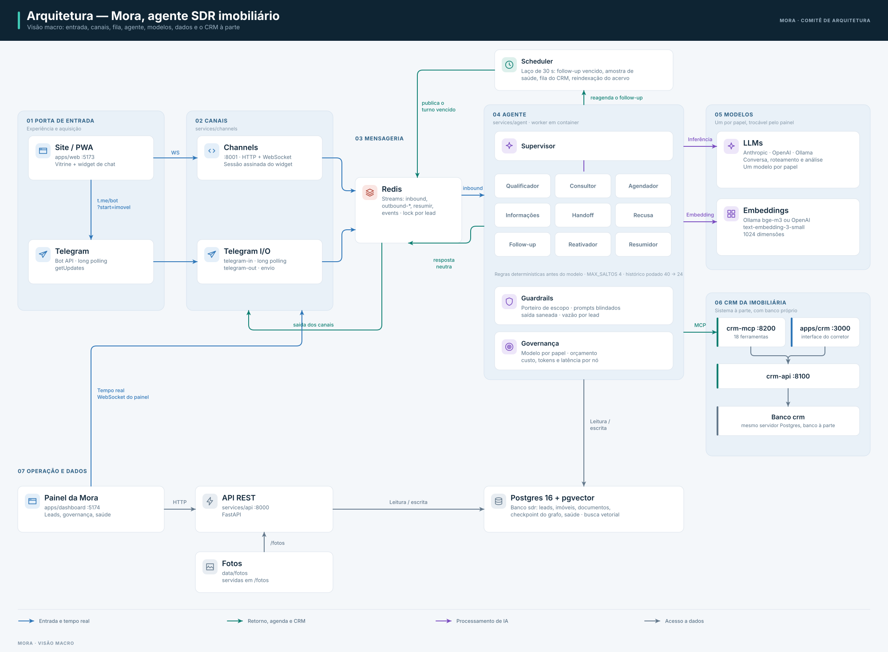
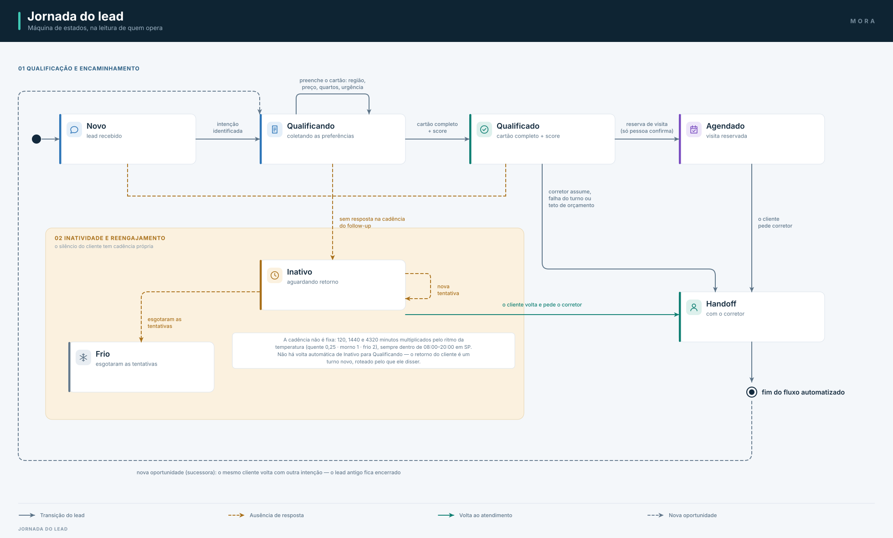

# Arquitetura — Mora, Agente SDR Imobiliário

> **Diagramas para banca:** [`docs/arquitetura.html`](arquitetura.html) — dossiê visual com os
> diagramas C4 do sistema, o grafo do agente, o índice de ADRs e as lacunas conhecidas entre este
> desenho e o código. Abra no navegador. Este arquivo aqui segue sendo a referência em texto.

## 1. Princípios

1. **Roda inteiro na máquina de quem avalia**: `docker compose up` sobe o sistema completo, sem
   conta em provedor, sem túnel e sem URL pública. Nada está implantado, e isso é escolha de escopo.
2. **Cérebro separado dos canais**: o agente não sabe se está no Telegram ou na web.
3. **Cada componente na sua pasta**: dependências e testes independentes; `shared/` é a única ponte.
4. **Reversibilidade**: cada dependência externa entra por uma porta (`shared/sdr_shared/ports`), e
   trocá-la é escrever um adaptador — não redesenhar o sistema (ver ADRs).

## 2. Visão macro

## 3. Componentes e como cada um executa

Todos os serviços Python compartilham a imagem de `local/Dockerfile.python`; o que muda entre
containers é o comando. Os nomes abaixo são os serviços de
`local/docker-compose.yml`.

| Componente | Pasta | Serviço no compose | Por quê |
|---|---|---|---|
| Canal Telegram | `services/channels/telegram` | `telegram-in`, `telegram-out` | Bot criado sem aprovação (@BotFather) e long polling: sem webhook, sem URL pública, sem túnel (ADR-0007) |
| Chat do site | `services/channels/local` | `channels` (`:8001`) | O mesmo processo serve o widget do site e o espelho em tempo real do painel |
| Agente | `services/agent` | `agent`, `resumidor`, `reativador` | Um turno leva de 20 a 40 s e não cabe no fio do HTTP: o agente é worker de fila (ADR-0002) |
| LLM | — | — | Anthropic (padrão), OpenAI ou Ollama, por `SDR_LLM_PROVIDER`, com reserva em `SDR_LLM_PROVIDER_FALLBACK` |
| Embeddings | — | `ollama` (`--profile ollama`) | Provedor único: o `bge-m3` dá as 1024 dimensões que o schema espera |
| RAG | `services/ingestion` | `agent` (execução pontual) | pgvector no mesmo banco do painel, com piso de similaridade e reescrita de consulta (ADR-0001) |
| Fila | `shared/sdr_shared/adapters/local/broker.py` | `redis` | Streams para os tópicos e locks para a ordem por lead |
| Dados | `shared/sdr_shared/db` | `db` (`pgvector/pgvector:pg16`) | Registro, vetores, agregação do painel e checkpointer do grafo na mesma base (ADR-0004) |
| Follow-up | `services/scheduler` | `scheduler` | Agendamento one-shot por lead gravado no Postgres; cancela quando o lead responde |
| API | `services/api` | `api` (`:8000`) | FastAPI; também serve as fotos do disco em `/fotos/...` |
| Front-ends | `apps/web`, `apps/dashboard` | `web` (`:5173`), `dashboard` (`:5174`) | Vite em modo dev, com o código montado por volume |
| CRM | `services/crm`, `apps/crm` | `crm-api` (`:8100`), `crm-mcp` (`:8200`), `crm-web` (`:3000`) | Sistema à parte, com banco próprio; a Mora entra por MCP sobre HTTP |
| Segredos | — | `local/.env` | Fora do versionamento; `scripts/check_env.py` recusa valor de exemplo antes de subir |
| Segurança | `agent/guardrails`, `shared/sdr_shared/seguranca` | — | Guardas determinísticas próprias, no código, não de um provedor |
| Observabilidade | `shared/sdr_shared/log.py`, tabelas `turnos`/`saude`/`batimentos` | `langfuse` (`--profile observability`) | Observabilidade leve no Postgres (ADR-0011); Langfuse opcional para tracing de prompt |

### 3.1. Detalhes que a execução em container obrigou a acertar

- **Uma imagem para todos os serviços Python**, construída a partir da raiz do repositório: todos
  dependem de `shared/`, e o código do host é montado por volume para a edição valer na hora.
- **As portas publicadas no host são deslocadas** (5433, 6380, 11435) porque Postgres, Redis e
  Ollama nativos costumam ocupar as padrão. Dentro da rede do compose valem sempre as internas.
- **`/health` do `channels` devolve 503 quando o Redis cai**, para o `docker compose ps` mostrar
  `(unhealthy)` em vez de "Up" com o chat mudo.
- **Os scripts de `docker-entrypoint-initdb.d` só rodam em volume novo.** Por isso `make preparar`
  cria e aplica banco e schema explicitamente, de forma idempotente.
- **O `crm-web` e o Langfuse publicam a mesma porta 3000** — os dois não sobem juntos.

## 4. Fluxo de negócio (máquina de estados do lead)

O cartão de qualificação (`shared/sdr_shared/models/lead.py`) é a fonte de verdade:
a cada turno o Qualificador recebe a lista de campos faltantes e conduz a conversa
humanizada para preenchê-los. O score de temperatura (quente/morno/frio) deriva do
cartão + sinais de comportamento (tempo de resposta, pediu visita, abriu imóveis no site).

## 5. Contratos entre camadas (`shared/sdr_shared/messaging`)

- `MensagemNormalizada`: `{lead_id, canal, tipo: texto|audio|localizacao|botao, conteudo, meta}` — o que qualquer canal entrega ao agente.
- `RespostaAgente`: `{texto, opcoes?: [str], imoveis?: [ImovelCard], acao?: agendar|handoff|encerrar}` — o que o agente devolve; o canal renderiza (botões, listas, cards).
- `EventoDominio`: `{tipo, lead_id, dados, em}`, publicado no tópico `sdr-events` do broker —
  `lead.created`, `lead.stage_changed`, `lead.inactive`, `visit.scheduled`.
- Tópicos de trabalho no mesmo broker: o `resumidor` consome `resumir`; o `reativador`,
  `imovel-novo`.

## 6. Multiagente (LangGraph)

Um estado único (`services/agent/src/agent/state.py`) compartilhado por todos os nós.
Supervisor (Haiku) roteia; só Qualificador, Consultor e Agendador falam com o lead, com a
mesma persona. Máximo de 4 saltos por turno para evitar pingue-pongue. Checkpointer em
Postgres = memória conversacional. Follow-up e Resumidor rodam fora do turno do lead.

## 7. Canais

- **Telegram**: bot próprio, criado na hora com o @BotFather — sem verificação de negócio e sem
  aprovação, e por long polling (`getUpdates`): sem webhook, sem URL pública e sem túnel (ADR-0007).
  Botões via teclado inline, cards com imagem e mensagens de voz, transcritas antes do grafo pelo
  `faster-whisper`. Sem janela de 24h nem template aprovado para follow-up.
- **Web**: widget no site vitrine, servido por `services/channels/local` (HTTP + WebSocket); lead
  anônimo por `session_id`, migra para Telegram mantendo histórico.
- **Site vitrine**: porta de entrada com contexto — `t.me/<bot>?start=IMOVEL-123` e eventos de
  navegação (`POST /eventos`) pré-preenchem o cartão do lead.
- **CLI**: `make cli` conversa com a Mora no terminal, sem canal externo nenhum.

## 8. O que ficou fora (avaliado e cortado)

App nativo (PWA cobre), Voice AI em tempo real (áudio → texto basta), multi-tenant e o canal
WhatsApp — que exigia número de negócio verificado e webhook com URL pública, e por isso foi
removido do código em favor do Telegram (ADR-0007).

## 9. Ordem de construção

1. `shared` + `services/agent` testado por CLI, com pgvector direto (sem canal externo).
2. Compose com banco, fila e canais; Telegram real via bot próprio (@BotFather).
3. `services/scheduler` (follow-up) e nó Resumidor.
4. `apps/web` (3 páginas) e `apps/dashboard`.
5. Guardrails, governança de custo, observabilidade leve, áudio e a ponte com o CRM por MCP.

## 10. Execução e custo

Não há dois ambientes: há um, o do `local/docker-compose.yml`, e ele é a entrega. `SDR_PROFILE`
(`local` | `producao`) decide apenas se o token estático de desenvolvimento vale — as portas em
`shared/sdr_shared/ports` continuam existindo porque são o contrato escrito de cada dependência e o
ponto onde o teste substitui a infraestrutura, não porque haja um segundo conjunto de adaptadores.

### O que custa

| Item | Custo | Observação |
|---|---|---|
| Postgres, Redis, canais, workers, API, front-ends, CRM | US$ 0 | Containers na máquina de quem avalia |
| Modelo de conversa e roteamento | Centavos por conversa | Único custo variável; Haiku em roteamento/extração já é a otimização (ADR-0010) |
| Embeddings (`bge-m3` no Ollama) | US$ 0 | Local, uma vez por documento indexado |
| Transcrição de voz (`faster-whisper`) | US$ 0 | No próprio processo, sem serviço externo nem cobrança por minuto |
| Bot do Telegram | US$ 0 | Criado no @BotFather, sem verificação |

Com `SDR_LLM_PROVIDER=ollama` o custo vai a zero por inteiro, em troca de qualidade de conversa
bem menor — serve para desenvolver, não para demonstrar.

### O que isso custa em contrapartida

Nada está implantado: não há URL para mandar a alguém, não há ambiente rodando fora da máquina de
quem sobe o compose, e o que existiu de infraestrutura como código foi removido do repositório junto
com os adaptadores que a acompanhavam (ADR-0002). É o preço aceito para que a avaliação não dependa
de conta, cota ou crédito em provedor nenhum.
