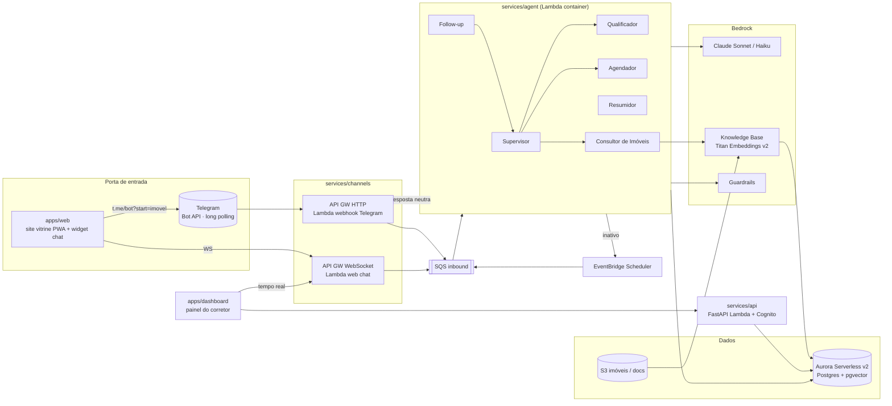
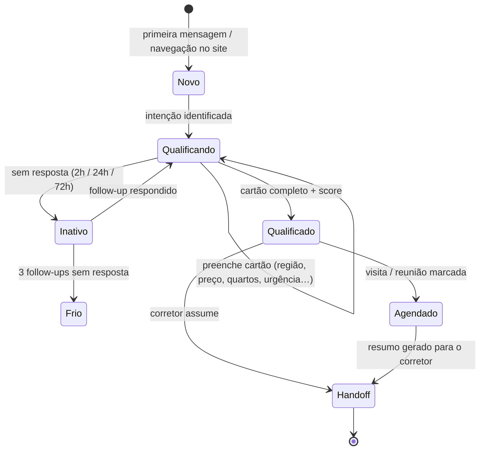

# Arquitetura — Mora, Agente SDR Imobiliário

> **Diagramas para banca:** [`docs/arquitetura.html`](arquitetura.html) — dossiê visual com os
> diagramas C4 dos perfis local e AWS, o grafo do agente, o índice de ADRs e as divergências
> conhecidas entre este desenho e a IaC. Abra no navegador. Este arquivo aqui segue sendo a
> referência em texto.

## 1. Princípios

1. **Cloud native de ponta a ponta**: nenhum servidor administrado; tudo gerenciado ou serverless na AWS.
2. **Cérebro separado dos canais**: o agente não sabe se está no Telegram ou na web.
3. **Cada componente na sua pasta**: dependências, testes e deploy independentes; `shared/` é a única ponte.
4. **Reversibilidade**: decisões arriscadas (Knowledge Base, Lambda) têm fallback sem redesenho (ver ADRs).

## 2. Visão macro

## 3. Componentes e serviços AWS

| Componente | Pasta | Serviço AWS | Por quê |
|---|---|---|---|
| Webhook Telegram | `services/channels/telegram` | API Gateway HTTP + Lambda (container) + SQS | Bot criado sem aprovação (@BotFather); local usa long polling, sem webhook nem túnel (ADR-0007) |
| Web chat | `services/channels/web` | API Gateway WebSocket + Lambda (container) | Mesmo canal serve widget do site e tempo real do dashboard |
| Agente | `services/agent` | Lambda (container) consumindo SQS | Mais serverless; fallback Fargate (ADR-0002) |
| LLM | — | Bedrock Claude Sonnet (conversa) / Haiku (roteamento, extração) | Custo x qualidade |
| RAG | `services/ingestion` | Bedrock Knowledge Base sobre S3, vector store Aurora pgvector | Serviço gerenciado visível; fallback pgvector direto (ADR-0001) |
| Dados | `shared/sdr_shared/db` | Aurora Serverless v2 (Postgres 16 + pgvector) | SQL para dashboard + vetores na mesma base; escala a zero |
| Follow-up | `services/scheduler` | EventBridge Scheduler (one-shot por lead) | Sem cron polling; cancela ao lead responder |
| Resumos | `services/agent` (nó Resumidor) | EventBridge (evento `lead.stage_changed`) → Lambda | Assíncrono, fora da conversa |
| API | `services/api` | API Gateway HTTP + Lambda container (FastAPI/Mangum) + Cognito | Auth nativa; API pública de imóveis com cache CloudFront |
| Front-ends | `apps/web`, `apps/dashboard` | Amplify Hosting (ou S3 + CloudFront) | CI/CD a partir do repo |
| Segredos | — | Secrets Manager | Token Meta, DSN |
| Segurança | — | Bedrock Guardrails (PII, tópicos), validação HMAC do webhook, WAF no API GW | Critério "segurança" |
| Observabilidade | — | CloudWatch + X-Ray; Langfuse (opcional, tracing de LLM) | Critério "observabilidade" |
| IaC | `infra/` | AWS CDK (Python) | Mesma linguagem do backend |

### 3.1. Detalhes que o `cdk synth` obrigou a acertar

- **Todas as Lambdas são imagens de container**, não zip: elas dependem de `sdr_shared`, `psycopg` e
  `httpx`, que um zip de código puro não carrega. Contexto de build = raiz do repositório.
- **Um único security group para as Lambdas**, criado na `NetworkStack`. A regra de entrada do Aurora
  referencia esse SG. Se cada stack criasse o seu, a `DataStack` passaria a depender da `AgentStack`
  (regra de SG) enquanto a `AgentStack` depende da `DataStack` (segredo do banco) — ciclo, e o synth falha.
- **Guardrails não têm `BR_CPF_NUMBER`**: a lista de PII do Bedrock é fixa e não inclui CPF, que entra
  como `regexesConfig` própria.
- **`FrontendStack` só publica os arquivos se `apps/<app>/dist` existir**, para o `cdk synth` da CI
  não exigir build dos fronts.

## 4. Fluxo de negócio (máquina de estados do lead)

O cartão de qualificação (`shared/sdr_shared/models/lead.py`) é a fonte de verdade:
a cada turno o Qualificador recebe a lista de campos faltantes e conduz a conversa
humanizada para preenchê-los. O score de temperatura (quente/morno/frio) deriva do
cartão + sinais de comportamento (tempo de resposta, pediu visita, abriu imóveis no site).

## 5. Contratos entre camadas (`shared/sdr_shared/messaging`)

- `MensagemNormalizada`: `{lead_id, canal, tipo: texto|audio|localizacao|botao, conteudo, meta}` — o que qualquer canal entrega ao agente.
- `RespostaAgente`: `{texto, opcoes?: [str], imoveis?: [ImovelCard], acao?: agendar|handoff|encerrar}` — o que o agente devolve; o canal renderiza (botões, listas, cards).
- Eventos de domínio (EventBridge): `lead.created`, `lead.stage_changed`, `lead.inactive`, `visit.scheduled`.

## 6. Multiagente (LangGraph)

Um estado único (`services/agent/src/agent/state.py`) compartilhado por todos os nós.
Supervisor (Haiku) roteia; só Qualificador, Consultor e Agendador falam com o lead, com a
mesma persona. Máximo de 4 saltos por turno para evitar pingue-pongue. Checkpointer em
Postgres = memória conversacional. Follow-up e Resumidor rodam fora do turno do lead.

## 7. Canais

- **Telegram**: bot próprio, criado na hora com o @BotFather — sem verificação de negócio, ao
  contrário do WhatsApp Cloud API (motivo da troca, ver ADR-0007). Botões via teclado inline (sem
  limite de 3 como o WhatsApp), cards com imagem, áudio (`voice`, transcrição ainda não plugada).
  Sem janela de 24h nem template aprovado para follow-up.
- **Web**: widget no site vitrine; lead anônimo por `session_id`, migra para Telegram mantendo histórico.
- **Site vitrine**: porta de entrada com contexto — `t.me/<bot>?start=IMOVEL-123` e eventos de
  navegação (`POST /eventos`) pré-preenchem o cartão do lead.
- **WhatsApp**: adapter mantido em `services/channels/whatsapp`, fora do compose local hoje — pronto
  para religar se um número de negócio verificado ficar disponível (ADR-0007).

## 8. O que ficou fora (avaliado e cortado)

App nativo (PWA cobre), CRM real (simulado no Aurora + endpoint `/crm/sync`), Voice AI em
tempo real (áudio → texto basta), multi-tenant, WhatsApp Business verificado da empresa.

## 9. Ordem de construção

1. `shared` + `services/agent` testado por CLI, com pgvector direto (sem canal externo, sem KB).
2. `infra` data + channels + agent; Telegram real via bot próprio (@BotFather).
3. `services/scheduler` (follow-up) e nó Resumidor.
4. `apps/web` (3 páginas) e `apps/dashboard`.
5. Knowledge Base, Guardrails, Cognito, observabilidade, áudio.

## 10. Perfis de execução e custo

O mesmo código roda em dois perfis, escolhidos por `SDR_PROFILE`. A troca acontece só nas bordas,
via portas em `shared/sdr_shared/ports` e adaptadores em `shared/sdr_shared/adapters/{aws,local}`.

### Estimativa AWS para a POC (us-east-1, uso de demo, ~1 mês)

| Item | Custo aproximado | Como reduzir |
|---|---|---|
| NAT Gateway | ~US$ 33/mês fixo + tráfego | **Maior custo fixo.** Trocar por VPC endpoints (Bedrock, SQS, Secrets ≈ US$ 7/mês cada) ou tirar as Lambdas da VPC e usar Aurora com Data API |
| Aurora Serverless v2 | US$ 0 pausado (0 ACU); ~US$ 0,12/ACU-h ativo → ~US$ 10–25/mês em uso de demo | Manter min 0 ACU; pausar fora da demo |
| Lambda (agent, canais, api) | < US$ 2/mês | Free tier cobre |
| Provisioned concurrency (agent) | ~US$ 5/mês | Ligar só nos dias de demo |
| Bedrock Claude (Sonnet+Haiku) | ~US$ 5–20/mês para centenas de conversas | Haiku em roteamento/extração já é a otimização |
| Bedrock Knowledge Base | US$ 0 (o custo é o vector store: Aurora, já contado) | Evitar OpenSearch Serverless (~US$ 175/mês mínimo!) |
| API Gateway, SQS, EventBridge, S3, CloudFront, Cognito, DynamoDB | < US$ 3/mês | Free tier |
| Guardrails | ~US$ 0,75/1000 unidades de texto | Aplicar só na conversa (Sonnet), não no roteamento |
| **Total estimado** | **US$ 25–70/mês** | Sem NAT e sem provisioned concurrency: **US$ 15–40/mês** |

Crédito de hackathon/AWS Activate costuma cobrir com folga. O que realmente estoura orçamento e foi
evitado: OpenSearch Serverless, Fargate sempre ligado, RDS provisionado.

### Perfil local (`local/`)

Custo: apenas o LLM por uso (Bedrock ou Anthropic API — centavos por conversa) ou zero com Ollama.
Meta Cloud API é gratuita para o número de teste; o túnel cloudflared é gratuito e sem conta.
Serve como ambiente de desenvolvimento diário mesmo quando a AWS é o alvo, e como plano B completo
para a demo (tudo roda num notebook).

### Perfil "AWS enxuto" (meio-termo)

Mesma infra CDK com três ajustes: (1) Lambdas fora da VPC e Aurora acessado via Data API (elimina NAT
e endpoints); (2) sem provisioned concurrency; (3) Guardrails só no nó de conversa.
Isso mantém 100% cloud native e leva o custo para a faixa de US$ 15–40/mês.
