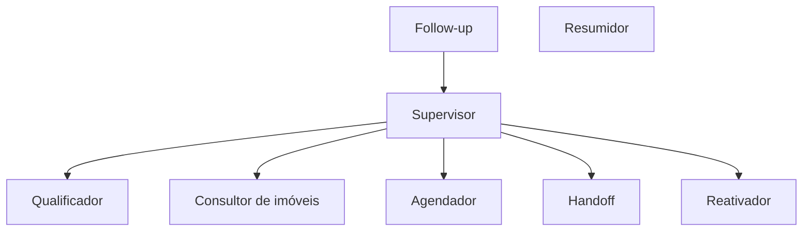

# Componentes

Cada componente vive na sua pasta, com dependências e testes independentes, comunicando-se apenas
por contratos definidos em `shared/`.

| Componente | Pasta | Responsabilidade |
|---|---|---|
| Site vitrine | `apps/web` | Catálogo e widget de chat; porta de entrada do cliente (PWA). |
| Painel do corretor | `apps/dashboard` | Funil, conversas, agenda, imóveis, governança e auditoria. |
| Painel do CRM | `apps/crm` | Interface do CRM da imobiliária (sistema à parte). |
| Canal do site | `services/channels/local` | Chat do site: HTTP + WebSocket, **sem regra de negócio**. |
| Canal Telegram | `services/channels/telegram` | Long polling de entrada (`getUpdates`) e worker de saída. |
| Agente | `services/agent` | Grafo multiagente; **único componente que fala com o LLM**. |
| API REST | `services/api` | Imóveis públicos, leads, dashboard, handoff, config, governança; serve as fotos em `/fotos/...`. |
| Scheduler | `services/scheduler` | Follow-up automático (agenda e cancela por lead). |
| Ingestão | `services/ingestion` | Carga de imóveis e de documentos institucionais, com embeddings. |
| CRM | `services/crm` | REST, servidor MCP e banco próprios; a Mora entra por MCP sobre HTTP. |
| Compartilhado | `shared/` | Modelos, contratos, repositórios (SQL + pgvector), portas e adaptadores. |
| Ambiente | `local/` | `docker-compose.yml` e a imagem única dos serviços Python. |

## Regras de dependência

- `shared/` é a **única ponte** entre serviços.
- Canais só traduzem mensagens e nunca chamam o LLM.
- O agente produz respostas neutras (`texto`, `opcoes`, `imoveis`, `acao`) e não sabe qual canal
  respondeu.

## Convenções relevantes

- Cada serviço expõe um pacote com nome próprio (`agent`, `api`, `canal_telegram`, `sdr_scheduler`,
  `sdr_ingestion`, `sdr_crm`) — nunca `src` — para evitar colisão no `sys.path`.
- Os serviços Python compartilham **uma única imagem** (`local/Dockerfile.python`), construída a
  partir da raiz do repositório porque todos dependem de `shared/`. O que muda entre containers é o
  comando, não a imagem; o código do host entra por volume, e a edição vale na hora.

## O grafo multiagente

O agente é um grafo LangGraph com um supervisor e nós especialistas:

- **Supervisor** — roteia por regra determinística; só chama o LLM na ambiguidade.
- **Qualificador** — preenche o cartão de qualificação (região, preço, quartos, urgência).
- **Consultor** — recomenda imóveis via RAG.
- **Agendador** — oferta e confirma horários de visita.
- **Follow-up** — reengaja leads inativos.
- **Handoff** — transfere ao corretor humano.
- **Resumidor** — gera o briefing para o corretor.
- **Reativador** — avisa um lead adormecido quando entra um imóvel que casa com a busca dele, e
  desliga o aviso quando ele pede para não receber ([ADR-0013](../adr/0013-reativacao-proativa-de-leads-adormecidos.md)).
