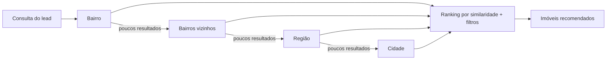

# Dados e persistência

## Banco único, dois perfis

O Mora usa **PostgreSQL com a extensão pgvector** para dados relacionais e vetores na mesma base:

- **Local** — container `pgvector/pgvector:pg16`.
- **AWS** — Aurora Serverless v2 (Postgres 16), que escala a zero quando ocioso (ADR-0004).

O schema fica em `shared/sdr_shared/db/schema.sql` e é aplicado na inicialização do container `db`
(local) ou via `make migrate`.

## RAG híbrido com cascata por localidade

A recomendação de imóveis combina filtros estruturados com busca vetorial, expandindo a área de busca
em cascata quando necessário:



- **Embeddings.** Amazon Titan Embeddings v2 (`amazon.titan-embed-text-v2:0`) no perfil AWS, ou Ollama
  `bge-m3` (1024 dimensões) localmente.
- **Dois caminhos de RAG.** Com `SDR_KNOWLEDGE_BASE_ID` definido, usa a Bedrock Knowledge Base
  (gerenciada); vazio, cai para **busca vetorial direta no Postgres** — o caminho testado localmente
  (ADR-0001).

!!! warning "Injeção indireta via RAG"
    A descrição de imóvel é **neutralizada** antes de entrar no prompt, para evitar que texto do
    catálogo funcione como instrução ao modelo. Veja [Segurança](../quality/seguranca.md).

## Observabilidade leve no banco

A observabilidade em vigor grava três tabelas no próprio Postgres — `turnos`, `saude` e `batimentos`
(ADR-0011) —, sem stack externa. Detalhes em [Observabilidade](../quality/observabilidade.md).

## Ingestão

O serviço `services/ingestion` carrega imóveis e gera embeddings. No perfil local:

```bash
make seed     # 200 imóveis determinísticos + embeddings
```

Reindexe com `make seed` sempre que editar bairros ou descrições, para não deixar embeddings
desatualizados.
