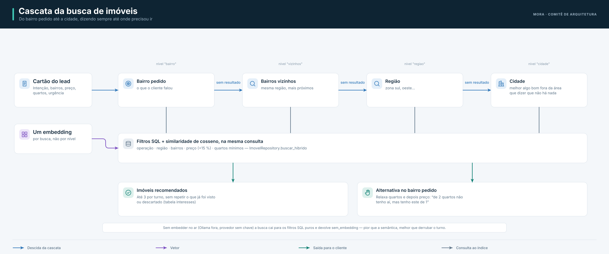

# Dados e persistência

## Um Postgres para tudo

O Mora usa **PostgreSQL com a extensão pgvector** para dados relacionais e vetores na mesma base: o
registro transacional (leads, visitas, imóveis), a busca vetorial, a agregação que o painel consulta
e o checkpointer do grafo cabem no mesmo banco (ADR-0004). É o container `db`
(`pgvector/pgvector:pg16`), publicado no host em `5433` para não colidir com um Postgres nativo.

O CRM é sistema à parte e tem **banco próprio** (`crm`) no mesmo servidor — a separação é o que
impede uma consulta cruzada de aparecer sem querer um dia.

O schema fica em `shared/sdr_shared/db/schema.sql`. Ele está montado em
`docker-entrypoint-initdb.d`, mas o Postgres só executa esses scripts quando o **volume é novo**:
num volume que já existia, quem aplica é `make migrate` (idempotente), que o `make preparar` chama.

## RAG híbrido com cascata por localidade

A recomendação de imóveis combina filtros estruturados com busca vetorial, expandindo a área de busca
em cascata quando necessário:



- **Embeddings.** Dois provedores, mesma dimensão: Ollama `bge-m3` (padrão, local) ou OpenAI
  `text-embedding-3-small` com `dimensions=1024` — o schema espera 1024, e trocar de modelo sem
  trocar essa coluna dá resultado errado sem erro nenhum. O local baixa com `make ollama-pull`.
- **Um caminho de RAG.** Busca vetorial direta no Postgres, no mesmo banco que o painel consulta
  (ADR-0001) — é o caminho testado, e é o único.

## RAG institucional (documentos da imobiliária)

FAQ, política de visita e tabela de taxas são texto corrido, não registro estruturado, e por isso
têm tratamento próprio em `shared/sdr_shared/conhecimento.py`:

- **Fatiamento por cabeçalho**, não por tamanho fixo: cada `##` já é a unidade de sentido, e o
  cabeçalho acompanha cada pedaço quando a seção precisa ser dividida.
- **Piso de similaridade de 0,35**: abaixo disso a busca devolve lista vazia, e o agente responde
  "não sei, o corretor confirma". Sem piso, uma pergunta que o corpus não cobre traz o vizinho mais
  próximo de coisa nenhuma — e vira afirmação falsa sobre a política da empresa.
- **Reescrita da consulta** com as falas anteriores do cliente: "e se eu sair antes?" não tem
  assunto nenhum para um embedding.
- **Fusão léxica (RRF)** implementada, testada e **desligada** por padrão, atrás de
  `SDR_RAG_LEXICO`: no único ambiente em que deu para medir, o A/B piorou o recall (31,9% → 29,8%),
  porque ali o embedder já é léxico e os dois sinais ficam redundantes. Quem tiver o `bge-m3` no ar
  decide com `SDR_RAG_LEXICO=1 make eval-rag`.

Indexe com `make docs-kb` (ou `make docs-secos`, que lista o que seria indexado sem tocar no banco).

!!! warning "Injeção indireta via RAG"
    A descrição de imóvel é **neutralizada** antes de entrar no prompt, para evitar que texto do
    catálogo funcione como instrução ao modelo. Veja [Segurança](../quality/seguranca.md).

## Observabilidade leve no banco

A observabilidade em vigor grava três tabelas no próprio Postgres — `turnos`, `saude` e `batimentos`
(ADR-0011) —, sem stack externa. Detalhes em [Observabilidade](../quality/observabilidade.md).

## Ingestão

O serviço `services/ingestion` carrega imóveis e documentos e gera os embeddings. Os dois alvos
rodam **dentro do container** do agente, e não no host: ali os padrões de conexão seriam
`localhost:5432` e `localhost:11434`, enquanto o compose publica em 5433 e 11435 — o melhor desfecho
seria falhar, e o pior, numa máquina com Postgres nativo, seria indexar no banco errado em silêncio.

```bash
make seed        # 200 imóveis determinísticos + embeddings
make docs-kb     # documentos institucionais → tabela `documentos`
```

Reindexe com `make seed` sempre que editar bairros ou descrições, para não deixar embeddings
desatualizados.
