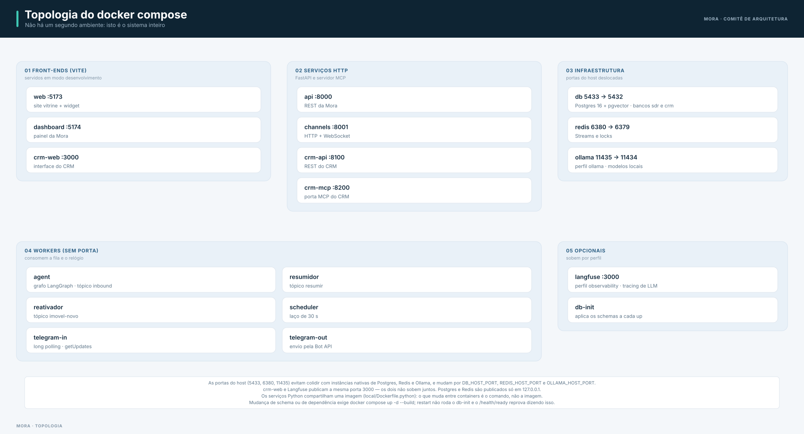

# Diagramas

## Topologia do `docker compose`

Não há um segundo ambiente: este é o sistema. Os nomes abaixo são os serviços de
`local/docker-compose.yml`.



As portas do host (5433, 6380, 11435) são deslocadas para não colidir com instâncias nativas de
Postgres, Redis e Ollama, e podem ser ajustadas por `DB_HOST_PORT`, `REDIS_HOST_PORT` e
`OLLAMA_HOST_PORT`. O `crm-web` e o Langfuse publicam a mesma porta 3000 — os dois não sobem juntos.

### Leitura do diagrama

- **Componentes.** Três front-ends, API, canal do site, os processos do Telegram, quatro workers
  (agente, resumidor, reativador, scheduler), o CRM (API + servidor MCP) e os armazenamentos
  (Postgres, Redis), mais os opcionais por profile (Ollama, Langfuse).
- **Comunicação.** Front-ends falam com API e canais; os workers consomem o Redis e o Postgres; o
  agente fala com o CRM por MCP sobre HTTP.
- **Pontos de falha.** Redis fora do ar deixa os canais `unhealthy` (o `/health` devolve 503 de
  verdade); Postgres indisponível degrada a API. Veja
  [Troubleshooting](../quality/troubleshooting.md).

## Outros fluxos

- **Fluxo principal do usuário** e **máquina de estados do lead** — em [Fluxo do agente e LLM](fluxo-agente.md).
- **Fluxo de dados / RAG** — em [Dados e persistência](dados.md).
- **Contexto geral** — em [Arquitetura — visão geral](index.md).

## Dossiê visual C4

O portal inclui um dossiê visual com os diagramas C4 do sistema, o grafo do agente, o índice de ADRs
e as lacunas conhecidas entre o desenho e o código:

- [`arquitetura.html`](../arquitetura.html){ target=_blank } — abra no navegador.

## Como estes diagramas são feitos

Os diagramas do portal não são imagens soltas nem Mermaid: são **SVG gerados por código**, em
`scripts/diagramas/`. Cada um é um módulo Python que declara as caixas, os grupos e as arestas
sobre um sistema visual comum (`base.py`), e sai em um arquivo sob `docs/assets/diagramas/`.

```bash
make diagramas                                        # regera os 10 SVG
npm i --no-save playwright                            # uma vez
node scripts/diagramas/verificar.mjs docs/assets/diagramas/*.svg
```

Por que assim, e não Mermaid: o Mermaid decide o layout sozinho, e é justamente isso que impedia o
controle de agrupamento, hierarquia e cor com significado que estes diagramas precisam. O preço é
declarar a posição; em troca, o conteúdo fica versionado como código e o mesmo arquivo serve o
portal e o README no GitHub.

**Tema único, de propósito.** O desenho é claro nos dois temas do portal. Manter uma versão escura
significaria dois arquivos por diagrama e duas chances de eles divergirem; o ganho não paga isso
numa POC. O `verificar.mjs` abre cada SVG no navegador e reprova texto que transborde da caixa que o
contém — um diagrama desenhado por coordenada erra em silêncio, e esse teste é o que impede o erro
de chegar ao portal.
