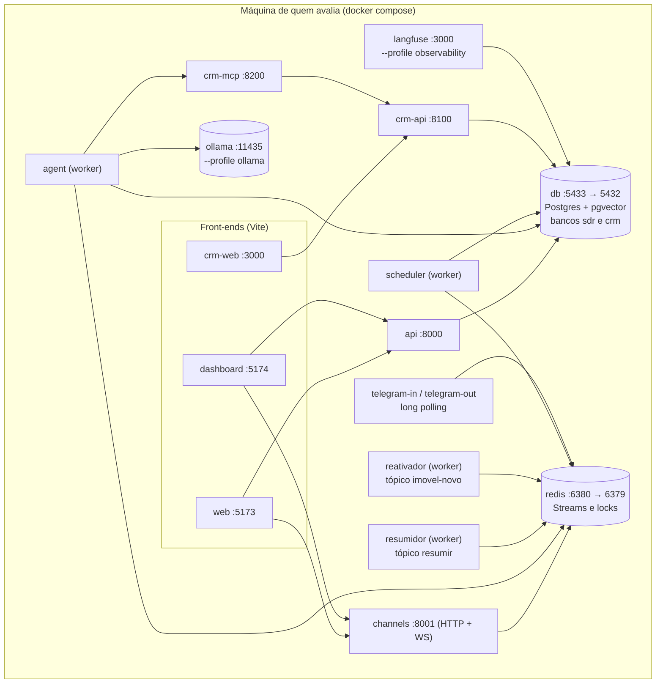

# Diagramas

## Topologia do `docker compose`

Não há um segundo ambiente: este é o sistema. Os nomes abaixo são os serviços de
`local/docker-compose.yml`.

As portas do host (5433, 6380, 11435) são deslocadas para não colidir com instâncias nativas de
Postgres, Redis e Ollama, e podem ser ajustadas por `DB_HOST_PORT`, `REDIS_HOST_PORT` e
`OLLAMA_HOST_PORT`. O `crm-web` e o Langfuse publicam a mesma porta 3000 — os dois não sobem juntos.

### Leitura do diagrama

- **Componentes.** Três front-ends, API, canal do site, os processos do Telegram, quatro workers
  (agente, resumidor, reativador, scheduler), o CRM (API + servidor MCP) e os armazenamentos
  (Postgres, Redis), mais os opcionais por profile (Ollama, Langfuse).
- **Comunicação.** Front-ends falam com API e canais; os workers consomem o Redis e o Postgres; o
  agente fala com o CRM por MCP sobre HTTP.
- **Pontos de falha.** Redis fora do ar deixa os canais `unhealthy` (o `/health` devolve 503 de
  verdade); Postgres indisponível degrada a API. Veja
  [Troubleshooting](../quality/troubleshooting.md).

## Outros fluxos

- **Fluxo principal do usuário** e **máquina de estados do lead** — em [Fluxo do agente e LLM](fluxo-agente.md).
- **Fluxo de dados / RAG** — em [Dados e persistência](dados.md).
- **Contexto geral** — em [Arquitetura — visão geral](index.md).

## Dossiê visual C4

O portal inclui um dossiê visual com os diagramas C4 do sistema, o grafo do agente, o índice de ADRs
e as lacunas conhecidas entre o desenho e o código:

- [`arquitetura.html`](../arquitetura.html){ target=_blank } — abra no navegador.

!!! note "Compatibilidade Mermaid"
    Os diagramas usam sintaxe Mermaid compatível com o GitHub e com o MkDocs Material (renderização via
    `pymdownx.superfences`).
