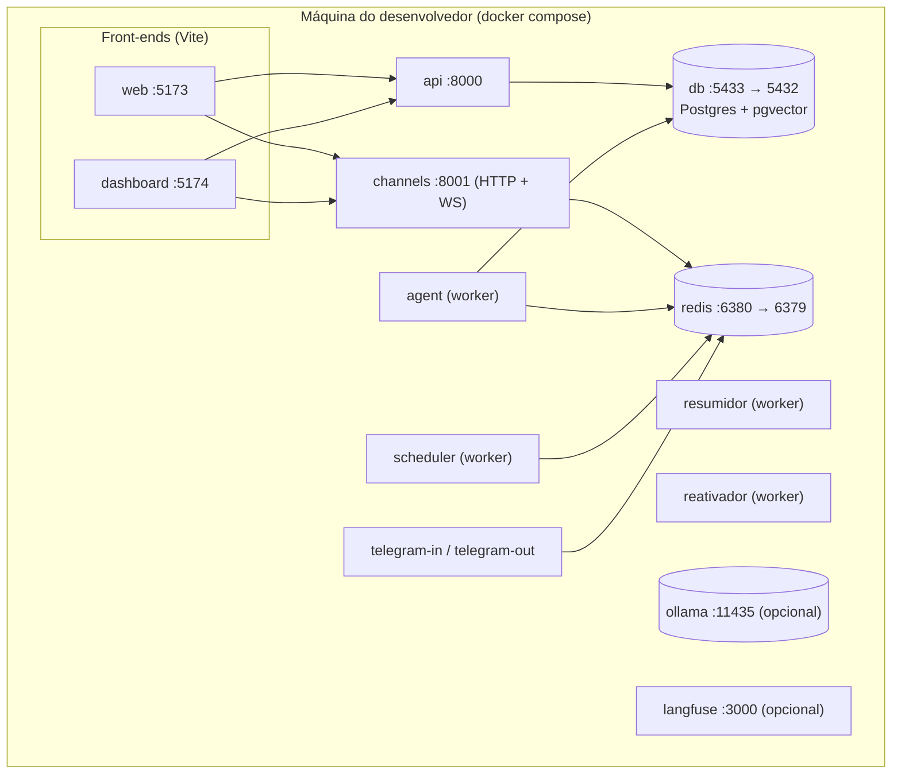

# Diagramas

## Implantação local (docker compose)

As portas do host (5433, 6380, 11435) são deslocadas para não colidir com instâncias nativas de
Postgres, Redis e Ollama, e podem ser ajustadas por `DB_HOST_PORT`, `REDIS_HOST_PORT` e
`OLLAMA_HOST_PORT`.

### Leitura do diagrama

- **Componentes.** Dois front-ends, API, canais, três workers (agente, resumidor, scheduler), os
  processos do Telegram, e os armazenamentos (Postgres, Redis) mais os opcionais (Ollama, Langfuse).
- **Comunicação.** Front-ends falam com API e canais; workers consomem o Redis (fila) e o Postgres.
- **Pontos de falha.** Redis fora do ar deixa os canais `unhealthy`; Postgres indisponível degrada a
  API. Veja [Troubleshooting](../quality/troubleshooting.md).

## Outros fluxos

- **Fluxo principal do usuário** e **máquina de estados do lead** — em [Fluxo do agente e LLM](fluxo-agente.md).
- **Fluxo de dados / RAG** — em [Dados e persistência](dados.md).
- **Contexto geral** — em [Arquitetura — visão geral](index.md).

## Dossiê visual C4

O portal inclui um dossiê visual com os diagramas C4 dos perfis local e AWS, o grafo do agente, o
índice de ADRs e as divergências conhecidas entre o desenho e a IaC:

- [`arquitetura.html`](../arquitetura.html){ target=_blank } — abra no navegador.

!!! note "Compatibilidade Mermaid"
    Os diagramas usam sintaxe Mermaid compatível com o GitHub e com o MkDocs Material (renderização via
    `pymdownx.superfences`).
