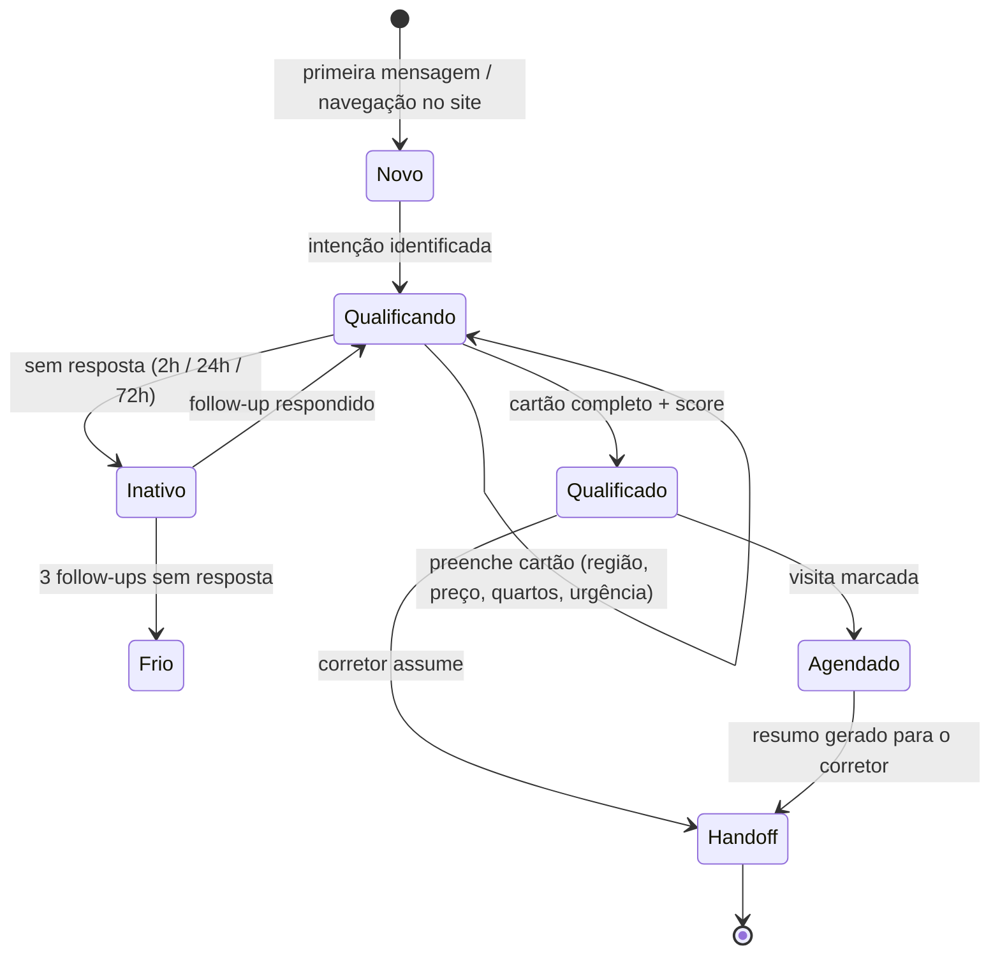
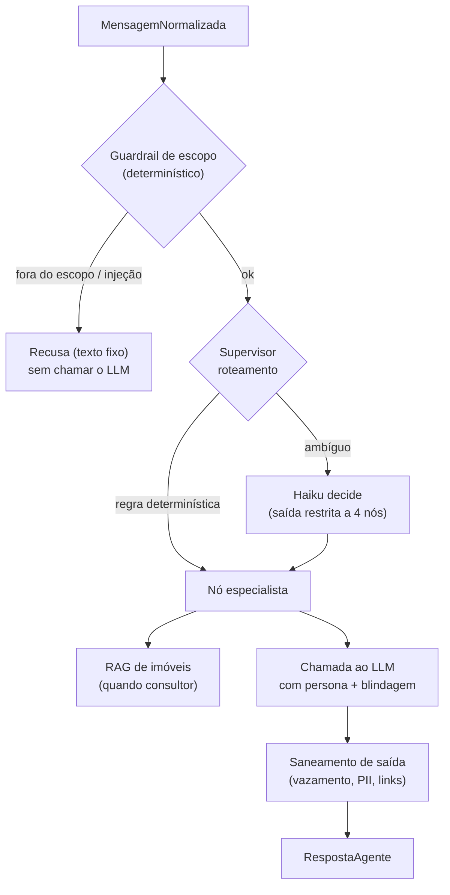

# Fluxo do agente e LLM

## Máquina de estados do lead

O **cartão de qualificação** (`shared/sdr_shared/models/lead.py`) é a fonte da verdade: a cada turno o
qualificador recebe a lista de campos faltantes e conduz a conversa para preenchê-los. O score de
temperatura deriva do cartão mais sinais de comportamento (tempo de resposta, pediu visita, abriu
imóveis no site).

## Roteamento e blindagem de prompt

O texto do cliente **nunca** é concatenado cru no prompt: entra em um bloco delimitado por sentinela
aleatória, com um cabeçalho de blindagem que instrui o modelo a tratá-lo como dado, não instrução. A
resposta do modelo passa por um saneamento final antes de virar mensagem.

!!! note "Entrada de áudio (multimodal)"
    Quando a mensagem é de **voz**, o agente transcreve o áudio **antes** do grafo
    (`handler._transcrever_se_audio`): baixa o arquivo do canal (Telegram ou WhatsApp) e transcreve com
    o motor configurado (faster-whisper no local, Amazon Transcribe na AWS). A transcrição entra no
    fluxo como texto do cliente — passando pela mesma blindagem acima. Se falhar, o cliente é convidado
    a escrever. Veja [Integrações](../technical-reference/integracoes.md#transcricao-de-audio-agente-multimodal).

### Leitura do fluxo

- **Componentes.** Guardrail de escopo, supervisor, nós especialistas, RAG, chamada ao LLM e saneamento.
- **Responsabilidades.** O guardrail barra abuso **antes** de gastar token; o supervisor decide o nó; o
  saneamento remove vazamento de instrução, mascara PII e remove links/código.
- **Decisões importantes.** Sonnet na conversa, Haiku no roteamento/extração (ADR-0010); roteamento
  determinístico primeiro para economizar chamadas.
- **Limites.** O agente só produz respostas neutras; a formatação por canal fica nos adaptadores.
- **Pontos de falha.** Provedor de LLM (mitigado por `SDR_LLM_PROVIDER_FALLBACK` e
  `SDR_LLM_TIMEOUT_S`). Detalhes em [Segurança](../quality/seguranca.md) e [Performance](../quality/performance.md).

## Modelos por nível

| Papel | Modelo padrão | Ajustável |
|---|---|---|
| Conversa com o cliente | `anthropic.claude-sonnet-4-5` | Sim, no painel (ADR-0010) |
| Roteamento / extração | `anthropic.claude-haiku-4-5` | Sim, no painel |

Os modelos são editáveis no painel sem redeploy. Provedores alternativos: `anthropic` (API) e `ollama`
(local), via `SDR_LLM_PROVIDER`.
