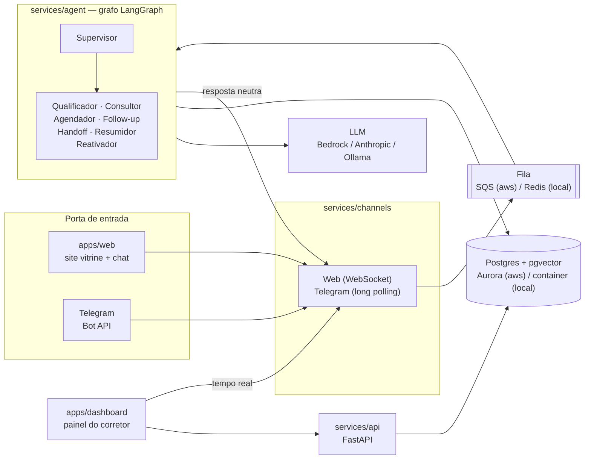

# Arquitetura — visão geral

O sistema separa o **cérebro** (o agente) dos **canais** (Telegram, web). O agente não sabe por qual
canal a mensagem chegou: cada canal traduz `evento do provedor → MensagemNormalizada` e
`RespostaAgente → formato do canal`. A única dependência cruzada permitida é o pacote `shared/`.

O mesmo código roda em dois perfis, escolhidos por `SDR_PROFILE`:

- **aws** — serverless (Lambda, SQS, EventBridge, Aurora).
- **local** — Docker Compose (containers, Redis, Postgres).

A troca acontece apenas nos adaptadores (`shared/sdr_shared/adapters/{aws,local}`).

## Princípios de arquitetura

1. **Cloud native de ponta a ponta** — nenhum servidor administrado; tudo gerenciado ou serverless na AWS.
2. **Cérebro separado dos canais** — o agente não sabe se está no Telegram ou na web.
3. **Cada componente na sua pasta** — dependências, testes e deploy independentes; `shared/` é a única ponte.
4. **Reversibilidade** — decisões arriscadas (Knowledge Base, Lambda) têm fallback sem redesenho.

## Diagrama de contexto (perfil local)

### Leitura do diagrama

- **Componentes.** Front-ends (`web`, `dashboard`), canais, fila, agente, LLM, banco e API.
- **Responsabilidades.** Os canais só traduzem mensagens; o agente é o único que fala com o LLM; a API
  serve dados ao painel.
- **Comunicação.** Cliente → canal → fila → agente → LLM/banco → resposta neutra → canal. O painel fala
  com a API (REST) e com os canais (tempo real).
- **Decisões importantes.** Fila desacopla canal e agente; adaptadores isolam o perfil (local/AWS).
- **Limites.** O agente não conhece o canal de origem; os canais não têm regra de negócio.
- **Pontos de falha.** Fila (Redis/SQS), provedor de LLM e banco. Health checks e fallback de LLM
  mitigam parte disso — veja [Troubleshooting](../quality/troubleshooting.md).

## Onde aprofundar

- [Componentes](componentes.md) — o papel de cada pasta.
- [Fluxo do agente e LLM](fluxo-agente.md) — máquina de estados do lead e blindagem de prompt.
- [Dados e persistência](dados.md) — Postgres, pgvector e RAG.
- [Decisões arquiteturais (ADRs)](decisoes.md) — os 12 registros de decisão.
- [Diagramas](diagramas.md) — implantação local e todos os fluxos.

!!! note "Referência completa"
    A [Referência completa (ARCHITECTURE.md)](../ARCHITECTURE.md) traz o desenho AWS detalhado, os
    contratos entre camadas e as estimativas de custo. Há também um dossiê visual C4 em
    [`arquitetura.html`](../arquitetura.html){ target=_blank } (abra no navegador).
