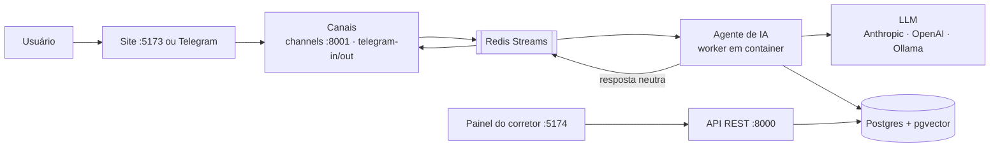

**Mora** — Agente SDR Imobiliário

Prova de conceito de um SDR (Sales Development Representative) imobiliário com IA generativa.
A agente virtual **Mora** atende o cliente, entende o que ele procura, recomenda imóveis do
catálogo, agenda visitas e passa o lead qualificado para um corretor humano.

Status: POC
PT-BR
Roda 100% local (docker compose)
Licença: MIT

[Começar agora](overview/quick-start.md){ .md-button .md-button--primary }
[Ver no GitHub](https://github.com/marcosvrc/agent-sdr-imoveis-mora){ .md-button }

Este portal é a **documentação detalhada** do projeto. O [`README.md`](https://github.com/marcosvrc/agent-sdr-imoveis-mora#readme)
do repositório continua sendo o guia rápido. Aqui você encontra arquitetura, manuais de uso, referência
da API, segurança, performance e operação.

## Destaques

### :material-robot: Atendimento com IA
Grafo multiagente (LangGraph) com supervisor, qualificador, consultor, agendador, follow-up, handoff e
resumidor e reativador. [Ver arquitetura](architecture/fluxo-agente.md)

### :material-magnify: Busca inteligente (RAG)
Recomendação por busca semântica com cascata por localidade (bairro → vizinhos → região → cidade),
sobre pgvector. [Ver dados](architecture/dados.md)

### :material-calendar-check: Agendamento e handoff
Oferta de horários em dois turnos e encaminhamento do lead qualificado ao corretor, com briefing
automático. [Ver manual do agente](user-guide/agente.md)

### :material-view-dashboard: Painel do corretor
Funil, conversas ao vivo, agenda, imóveis, corretores, configuração do agente e auditoria.
[Ver manual do painel](user-guide/painel.md)

### :material-shield-check: Segurança determinística
Guardrails de escopo, blindagem de prompt, saneamento de saída e rate limiting por lead.
[Ver segurança](quality/seguranca.md)

### :material-chart-line: Governança de IA
Registro por chamada, custo por modelo e orçamento com degradação automática.
[Ver observabilidade](quality/observabilidade.md)

## Como o sistema funciona

O sistema separa o **cérebro** (o agente) dos **canais** (site e Telegram). O agente não sabe por qual
canal a mensagem chegou: cada canal traduz o evento do provedor para um formato neutro e vice-versa.

Tudo isso são containers de um único `docker compose`: o sistema roda inteiro na máquina de quem
avalia, e **nada está implantado** — é escolha de escopo, não pendência. Detalhes em
[Arquitetura](architecture/index.md).

## Links rápidos

- :material-rocket-launch: [Executar localmente](getting-started/docker.md)
- :material-sitemap: [Conhecer a arquitetura](architecture/index.md)
- :material-robot: [Usar o agente](user-guide/agente.md)
- :material-view-dashboard: [Acessar o painel administrativo](user-guide/painel.md)
- :material-office-building: [Operar o CRM](user-guide/crm.md)
- :material-brain: [Como o agente funciona por dentro](architecture/fluxo-agente.md)
- :material-scale-balance: [Modelos: decisões e comparativos](architecture/modelos.md)
- :material-gavel: [Regras de negócio](technical-reference/regras-de-negocio.md)
- :material-api: [Consultar a API](technical-reference/api.md)
- :material-source-pull: [Contribuir](project/contribuir.md)

!!! note "Sobre esta POC"
    O Mora é uma prova de conceito. A entrega roda inteira por `docker compose` na máquina de quem
    avalia, sem conta em provedor nenhum e sem nada implantado. Veja o estado real em
    [Funcionalidades](overview/funcionalidades.md).
