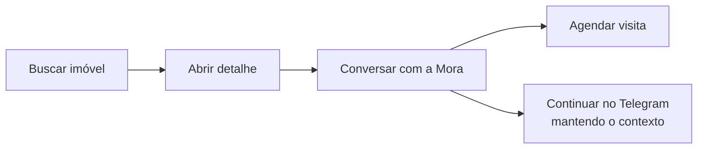

# Manual do site

## Acesso

<http://localhost:5173> — não requer login.

## Navegação

Página inicial com destaques, catálogo (`/imoveis`), detalhe do imóvel e favoritos.

## Pesquisa e filtros

Busca por texto e filtros por operação (venda / aluguel), região, faixa de preço e quartos.

## Resultados

Cards com foto, preço e características. A página de detalhe traz galeria e um CTA (call to action,
chamada para ação) para conversar com a Mora sobre aquele imóvel.

## Jornadas principais

O site é um PWA (Progressive Web App) com tracking de navegação, que alimenta o cartão do lead, e
cuidados de SEO e acessibilidade (ADR-0012). O CTA de continuidade no Telegram preserva o histórico da
conversa (ADR-0006).
